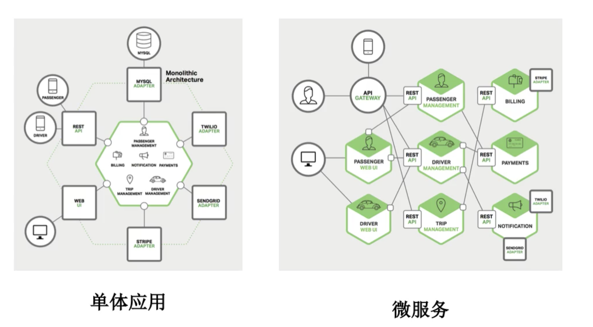
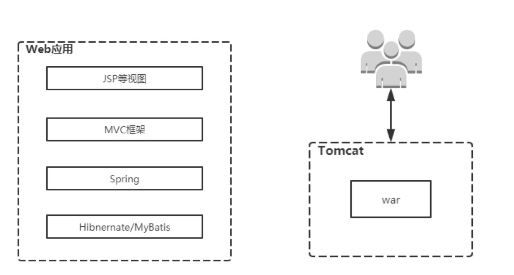
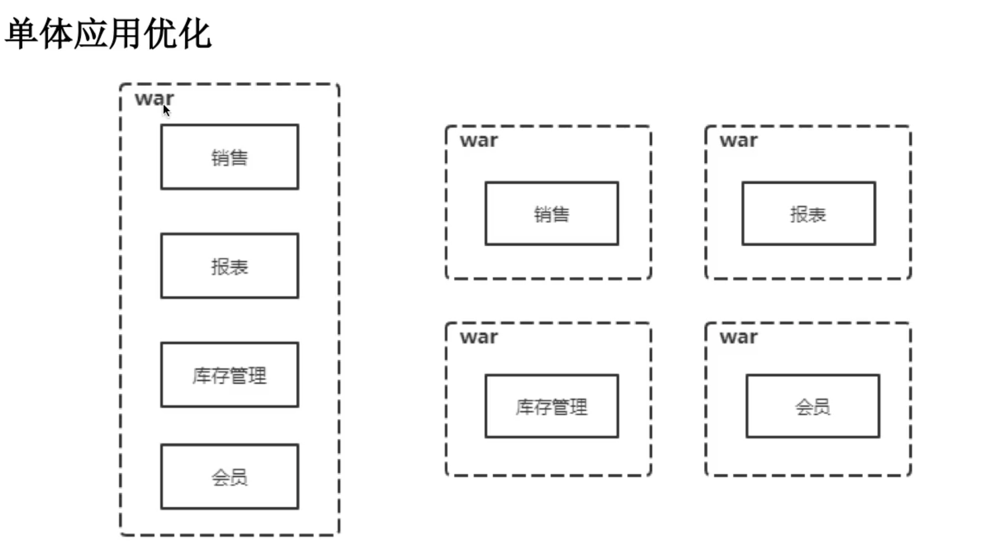
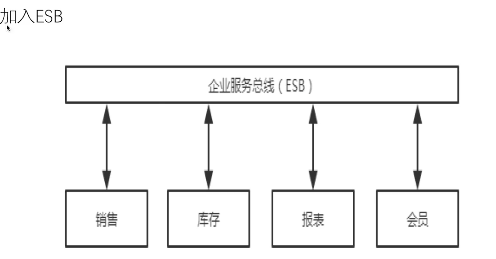
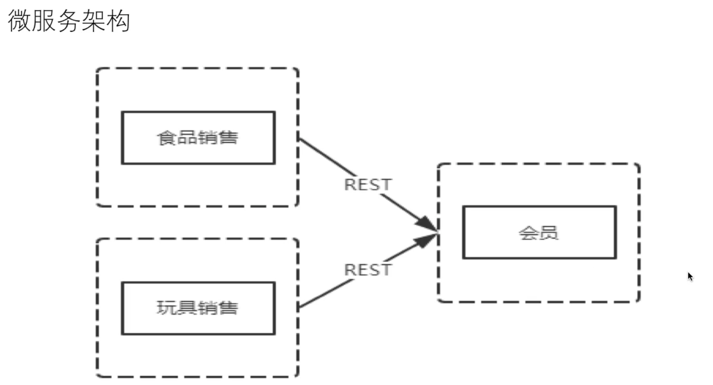
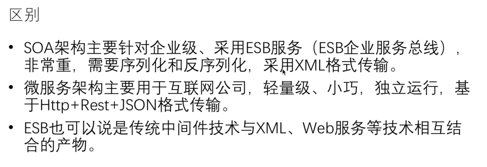
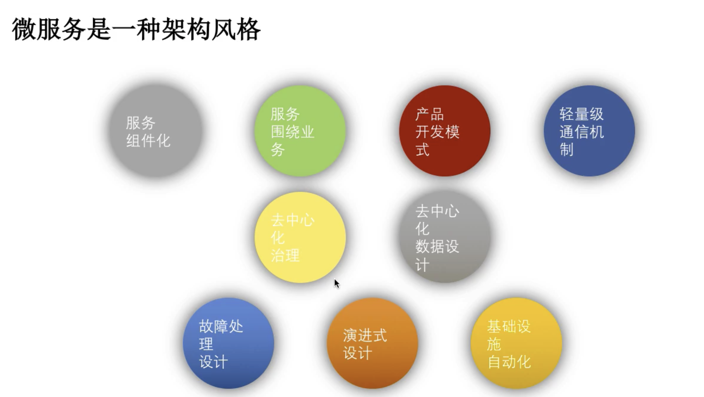
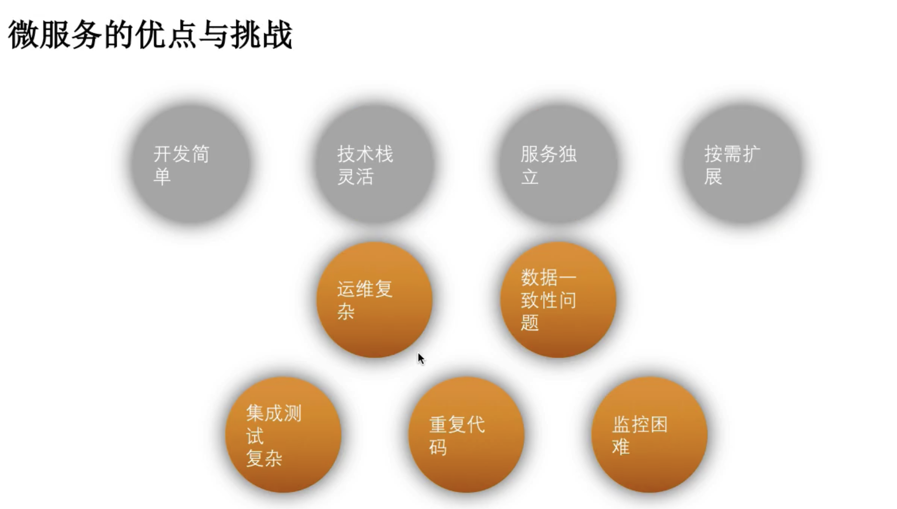
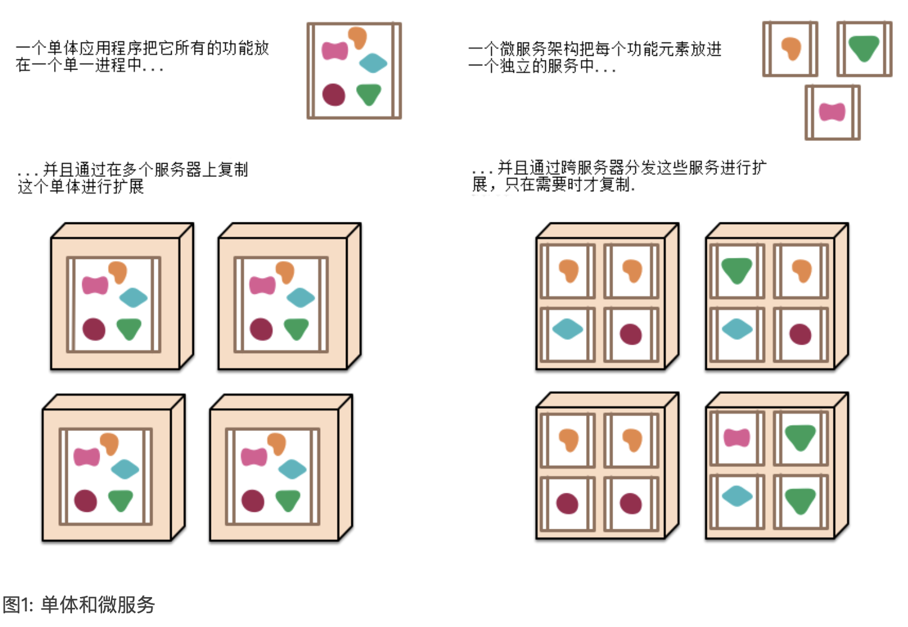
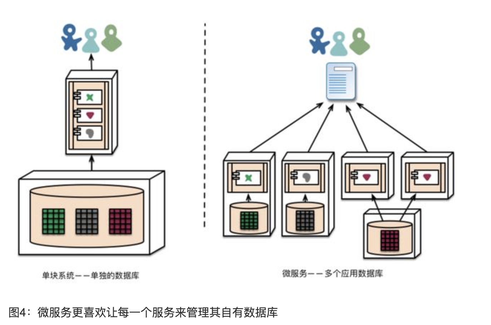

##  微服务(MicroService)

In short, the microservice architectural style is an approach to developing a single application as a **suite of small services**, each **running in its own process** and communicating with lightweight mechanisms, often an HTTP resource API. These services are **built around business capabilities** and **independently deployable** by fully automated deployment machinery. There is a **bare minimum of centralized management** of these services, which may be written in different programming languages and use different data storage technologies.

**Martin Fowler：**简而言之，微服务架构风格这种开发方法，是以开发一组小型服务的方式来开发一个独立的应用系统。其中每个小型服务都运行在自己的进程中，并经常采用HTTP资源API这样轻量的机制来相互通信。这些服务围绕业务功能进行构建，并能通过全自动的部署机制来进行独立部署。这些微服务可以使用不同的语言来编写，并且可以使用不同的数据存储技术。对这些微服务我们仅做最低限度的集中管理。

<h4>1.1单体应用与微服务比较</h4>

| 单体应用                                                     | 微服务                                                       |
| ------------------------------------------------------------ | ------------------------------------------------------------ |
| 应用程序被构建为单一单元，应用程序运行在一个进程中           | 应用程序通常根据业务拆分成不同的模块，每个模块是一个独立的服务，其各自运行在不同的进程中，每个模块可以用不同的编程语言编写，可以用不同的数据存储系统。 |
| 如果程序有变更，需要将整个单体进行重新构建并部署，可伸缩性差 | 只需将变更的这个模块进行构建及部署，不影响其他模块，可伸缩性好 |
| 通过在多个服务器上复制整个单体来实现扩展                     | 通过跨服务器分发微服务中的模块来进行扩展，不同的模块按需求复制多份 |

<h5>单体架构存在的缺点</h5>

- 复杂性逐渐变高
- 技术债务逐渐上升
- 部署速度逐渐变慢
- 阻碍技术创新
- 无法按需伸缩

<h5>微服务具备的特性</h5>

- 每个微服务可独立运行在自己的进程中
- 一系列独立运行的微服务共同构建起了整个系统
- 每个服务为独立的业务开发，一个微服务一般完成某个特定的功能，比如：订单管理、用户管理等
- 微服务之间通过一些轻量的通信机制进行通信，例如通过REST API或者RPC的方式进行调用

<h5>微服务的优点</h5>

- 易于开发和维护
- 启动较快
- 局部修改容易部署
- 技术栈不受限
- 按需伸缩
- DevOps

<h5>微服务带来的挑战</h5>

- 运维成本高
- 分布式的复杂性
- 接口调整成本高
- 重复劳动

<h4>1.2 微服务架构的特征</h4>

<h5>特性一：组件化与多服务</h5>

组件是一个可独立替换和独立升级的软件单元。微服务架构将使用库，但组件化软件的主要方式是分解成服务。我们把库定义为链接到程序并使用内存函数调用来调用的组件，而服务是一种进程外的组件，它通过web服务请求或rpc(远程过程调用)机制通信(这和很多面向对象程序中的服务对象的概念是不同的。

以使用服务（而不是以软件库）的方式来实现组件化的一个主要原因是，服务可被独立部署。如果一个应用系统由在单个进程中的多个软件库所组成，那么对任一组件做一处修改，都不得不重新部署整个应用系统。但是如果该应用系统被分解为多个服务，那么对于一个服务的多处修改，仅需要重新部署这一个服务。当然这也不是绝对的，一些变更服务接口的修改会导致多个服务之间的协同修改。但是一个良好的微服务架构的目的，是通过内聚的服务边界和服务协议方面的演进机制，来将这样的修改变得最小化。

以服务的方式来实现组件化的另一个结果，是能获得更加显式的（explicit）组件接口。大多数编程语言并没有一个良好的机制来定义显式的发布接口。通常情况下，这样的接口仅仅是文档声明和团队纪律，来避免客户端破坏组件的封装，从而导致组件间出现过度紧密的耦合。通过使用显式的远程调用机制，服务能更容易地规避这种情况。

如此使用服务，也会有不足之处。比起进程内调用，远程调用更加昂贵。所以远程调用API接口必须是粗粒度的，而这往往更加难以使用。如果需要修改组件间的职责分配，那么当跨越进程边界时，这种组件行为的改动会更加难以实现。

<h5>特性二：围绕“业务功能”的组织团队</h5>

<h5>特性三：“做产品”而不是“做项目”</h5>

<h5>特性四：“智能端点”与“傻瓜管道”</h5>

微服务社区主张采用另一种做法：智能端点(smart endpoints)和傻瓜管道(dumb pipes)。使用微服务所构建的各个应用的目标，都是尽可能地实现“高内聚和低耦合”——他们拥有自己的领域逻辑，并且更像是经典Unix的“过滤器”(filter)那样来工作——即接收一个请求，酌情对其应用业务逻辑，并产生一个响应。这些应用通过使用一些简单的REST风格的协议来进行编制，而不去使用诸如下面这些复杂的协议，即”WS-编制”(WS-Choreography)、BPEL或通过位于中心的工具来进行编排(orchestration)。

微服务最常用的两种协议是：带有资源API的HTTP“请求－响应”协议，和轻量级的消息发送协议。

最常用的第二种协议，是通过一个轻量级的消息总线来进行消息发送。此时所选择的基础设施，通常是“傻瓜”(dumb)型的(仅仅像消息路由器所做的事情那样傻瓜)——像RabbitMQ或ZeroMQ那样的简单实现，即除了提供可靠的异步机制(fabric)以外不做其他任何事情——智能功能存在于那些生产和消费诸多消息的各个端点中，即存在于各个服务中。

在一个单块系统中，各个组件在同一个进程中运行。它们相互之间的通信，要么通过方法调用，要么通过函数调用来进行。将一个单块系统改造为若干微服务的最大问题，在于对通信模式的改变。仅仅将内存中的方法调用转换为RPC调用这样天真的做法，会导致微服务之间产生繁琐的通信，使得系统表现变糟。取而代之的是，需要用更粗粒度的协议来替代细粒度的服务间通信。

<h5>特性五：“去中心化”的治理技术</h5>

如果能将单块应用的那些组件拆分成多个服务，那么在构建每个服务时，就可以有选择不同技术栈的机会。想要使用Node.js来搞出一个简单的报表页面？尽管去搞。想用C  来做一个特别出彩的近乎实时的组件？没有问题。想要换一种不同风格的数据库，来更好地适应一个组件的读取数据的行为？可以重建。

<h5>特性六：“去中心化”地管理数据</h5>

如同在概念模型上进行去中心化的决策一样，微服务也在数据存储上进行去中心化的决策。尽管各个单块应用更愿意在逻辑上各自使用一个单独的数据库来持久化数据，但是各家企业往往喜欢一系列单块应用共用一个单独的数据库——许多这样的决策是被供应商的各种版权商业模式所驱动出来的。微服务更喜欢让每一个服务来管理其自有数据库。其实现可以采用相同数据库技术的不同数据库实例，也可以采用完全不同的数据库系统。这种方法被称作“多语种持久化”(Polyglot Persistence)。在一个单块系统中也能使用多语种持久化，但是看起来这种方法在微服务中出现得更加频繁。

在各个微服务之间将数据的职责进行“去中心化”的管理，会影响软件更新的管理。处理软件更新的常用方法，是当更新多个资源的时候，使用事务来保证一致性。这种方法经常在单块系统中被采用。

像这样使用事务，有助于保持数据一致性。但是在时域上会引发明显的耦合，这样一来，在多个服务之间处理事务时会出现一致性问题。分布式事务实现难度之大是不必多言的。为此，微服务架构更强调在各个服务之间进行“无事务”的协调。这源自微服务社区明确地认识到下述两点，即数据一致性可能只要求数据在最终达到一致，并且一致性问题能够通过补偿操作来进行处理。

对于许多开发团队来说，选择这种方式来管理数据的“非一致性”，是一个新的挑战。但这通常也符合在商业上的实践做法。通常情况下，为了快速响应需求，商家们都会处理一定程度上的数据“非一致性”，通过做某种反向过程来进行错误处理。只要修复错误的成本低于“保持更大的数据一致性却导致丢了生意所产生”的成本相比，那么进行这种“非一致性”地数据管理就是值得的。

<h5>特性七：“基础设施”自动化</h5>

<h5>特性八：“容错”设计</h5>

<h5>特性九：“演进式”设计</h5>

